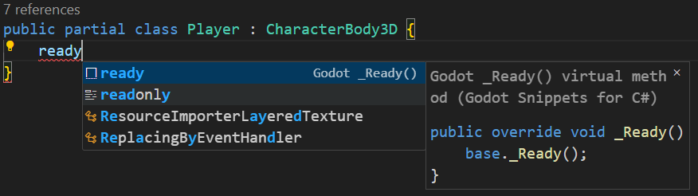
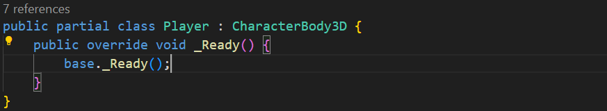

# Godot Snippets for C#


Provides a set of code snippets for Godot in C#, click [here](https://marketplace.visualstudio.com/items?itemName=altamkp.godot-snippets-vscode-gdscript) for a gdscript version instead.

## Installation

[Visual Studio Marketplace](https://marketplace.visualstudio.com/items?itemName=altamkp.godot-snippets-vscode-csharp)

## Quick start

In any `.cs` files, start typing a prefix such as `ready`.



Press `tab` to select the snippet from the suggestions.



## Available snippets

### Utilities

<table>
<tr>
<td> Prefix </td> <td> Body </td>
</tr>
<tr>
<td>

`print`

</td>
<td>

```csharp
GD.Print();
```

</td>
</tr>
</table>

### Exported properties

<table>
<tr>
<td> Prefix </td> <td> Body </td>
</tr>
<tr>
<td>

`export`

</td>
<td>

```csharp
[Export] private Node _node;
```

</td>
</tr>
<tr>
<td>

`exportg`

</td>
<td>

```csharp
[ExportGroup("")]
```

</td>
</tr>
<tr>
<td>

`exportsg`

</td>
<td>

```csharp
[ExportSubgroup("")]
```

</td>
</tr>
<tr>
<td>

`exportc`

</td>
<td>

```csharp
[ExportCategory("")]
```

</td>
</tr>
</table>

### Lifecycle virtual methods

<table>
<tr>
<td> Prefix </td> <td> Body </td>
</tr>
<tr>
<td>

`entertree`

</td>
<td>

```csharp
public override void _EnterTree() {
    base._EnterTree();
}
```

</td>
</tr>
<tr>
<td>

`ready`

</td>
<td>

```csharp
public override void _Ready() {
    base._Ready();
}
```

</td>
</tr>
<tr>
<td>

`process`

</td>
<td>

```csharp
public override void _Process(double delta) {
    base._Process(delta);
}
```

</td>
</tr>
<tr>
<td>

`processp`

</td>
<td>

```csharp
public override void _PhysicsProcess(double delta) {
    base._PhysicsProcess(delta);
}
```

</td>
</tr>
<tr>
<td>

`exittree`

</td>
<td>

```csharp
public override void _ExitTree() {
    base._ExitTree();
}
```

</td>
</tr>
</table>

### Input virtual methods

<table>
<tr>
<td> Prefix </td> <td> Body </td>
</tr>
<tr>
<td>

`input`

</td>
<td>

```csharp
public override void _Input(InputEvent @event) {
    base._Input(@event);
}
```

</td>
</tr>
<tr>
<td>

`inputs`

</td>
<td>

```csharp
public override void _ShortcutInput(InputEvent @event) {
    base._ShortcutInput(@event);
}
```

</td>
</tr>
<tr>
<td>

`inputu`

</td>
<td>

```csharp
public override void _UnhandledInput(InputEvent @event) {
    base._UnhandledInput(@event);
}
```

</td>
</tr>
<tr>
<td>

`inputg`

</td>
<td>

```csharp
public override void _GuiInput(InputEvent @event) {
    base._GuiInput(@event);
}
```

</td>
</tr>
</table>

### Other virtual methods

<table>
<tr>
<td> Prefix </td> <td> Body </td>
</tr>
<tr>
<td>

`noti`

</td>
<td>

```csharp
public override void _Notification(int what) {
    base._Notification(what);
}
```

</td>
</tr>
<tr>
<td>

`draw`

</td>
<td>

```csharp
public override void _Draw() {
    base._Draw();
}
```

</td>
</tr>
</table>
